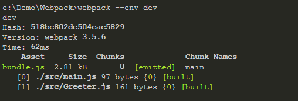

# 解析Webpack打包
> 基于开发中的项目

## package.json
> 首先了解 package.json 文件

**该 JSON 文件中通常包含了以下属性**
* name
* version
* ······
* engines  指定运行环境中的 node 版本，无指定则任意版本都能运行
* scripts
* dependencies 通过 npm install ** --save 安装的依赖，一般都是用在开发中 require or import 来使用
* devDependencies 通过 npm install ** --save-dev 安装，一般是在项目构建或打包的使用被依赖所调用

```
  "scripts": {
    "dev": "cross-env NODE_ENV=master node build/dev-server.js",
    "start": "npm run dev",
    "build": "rm -rf dist && webpack --progress --hide-modules --config build/webpack.prod.conf.js",
    "lint": "eslint --fix --ext .js,.vue client",
    "test": "npm run lint"
  }

  script 主要是为 node 运行代码提供快捷运行方式，通过 npm run * 运行，start 除外
```

## 什么是Webpack
Webpack 是一个静态模块打包器：主要负责分析项目结构，找到JavaScript模块以及其它的一些浏览器不能直接运行的拓展语言（Scss,TypeScript等），并将其转换和打包为合适的格式供浏览器使用。

__包含四个核心概念：__

* 入口(entry)
* 输出(output)
* loader
* 插件(plugins)

### 最简单的 Webpack 打包配置

> dist      
>> index.html 

> src                  
>> Greeter.js     
>> main.js   

> webpack.config.js             

__webpack.config.js__
```
const path = require('path');
module.exports = function buildCon(env) {
  console.log(env);
  return {
    entry: path.resolve('./src/main.js'),
    output: {
      path: path.resolve('./dist'),
      filename: 'bundle.js'
    }
  }
}
```

__dist/index.html__
```
<!DOCTYPE html>
<html lang="en">
<head>
  <meta charset="UTF-8">
  <meta name="viewport" content="width=device-width, initial-scale=1.0">
  <meta http-equiv="X-UA-Compatible" content="ie=edge">
  <title>Document</title>
</head>
<body>
  <div id="root"></div>
  <script src="./bundle.js"></script>
</body>
</html>
```

__src/Greeter.js__
```
module.exports = function() {
  var greet = document.createElement('div');
  greet.textContent = "Hi there and greetings!";
  return greet;
};
```

__src/main.js__
```
const greeter = require('./Greeter.js');
document.querySelector('#root').appendChild(greeter());

CMD 中运行 webpack --env=dev 会在 dist 目录下打包生成一个bundle.js，并且打印 env 参数
```


## build 目录包含 webpack 个版本打包逻辑

__目录结构如下__

> build             
>> build-testing.js     
>> build-config.js      
>> build.js       
>> utils.js        
>> vue-loader.config.js              
>> webpack.base.config.js -- 基础打包配置            
>> webpack.dev.config.js -- dev 环境             
>> webpack.prod.config.js -- production 环境            
>> webpack.test.config.js

### webpack.base.config.js

> 为公用的打包配置文件，以下打包文件都以该文件为基础进行拓展

```
/**
*  其他的配置文件通过 webpack-merge 合并 webpack.base.config.js 并进行拓展
*/
const merge = rquire('webpack-merge');
const baseWebpackConfig = require('./webpack.base.config');

const webpackConfig = merge(baseWebpackConfig, {
  module: {}
  ······
})

module.exports = webpackConfig;
```

```
"use strict";

const path = require("path");
const config = require("./build.conf");
const utils = require("./utils");
const projectRoot = path.resolve(__dirname, "../");

module.exports = {
  entry: {
    app: ["./client/index.js"],
    vendor: ["vue", "vue-router", "vuex", "vuex-router-sync"]
  },
  output: {
    path: path.join(__dirname, '../dist/csp')
  },
  resolve: {
    extensions: [".js", ".vue", ".css", ".json"],
    alias: {
      package: path.resolve(__dirname, "../package.json"),
      src: path.resolve(__dirname, "../client"),
      assets: path.resolve(__dirname, "../client/assets"),
      components: path.resolve(__dirname, "../client/components"),
      views: path.resolve(__dirname, "../client/views"),
      "plotly.js": "plotly.js/dist/plotly",
      "vuex-store": path.resolve(__dirname, "../client/store")
    }
  },
  module: {
    loaders: [
      {
        test: /\.vue$/,
        loader: "vue-loader",
        options: require("./vue-loader.conf")
      },
      {
        test: /\.js$/,
        loader: "babel-loader",
        include: projectRoot,
        exclude: [new RegExp(`node_modules\\${path.sep}(?!vue-bulma-.*)`)]
      },
      {
        test: /\.(png|jpe?g|gif|svg)(\?.*)?$/,
        loader: "url-loader",
        query: {
          limit: 10000,
          name: utils.assetsPath("img/[name].[hash:7].[ext]")
        }
      },
      {
        test: /\.(woff2?|eot|ttf|otf)(\?.*)?$/,
        loader: "url-loader",
        query: {
          limit: 10000,
          name: utils.assetsPath("fonts/[name].[hash:7].[ext]")
        }
      }
    ]
  },
  performance: {
    hints: false
  }
};
```